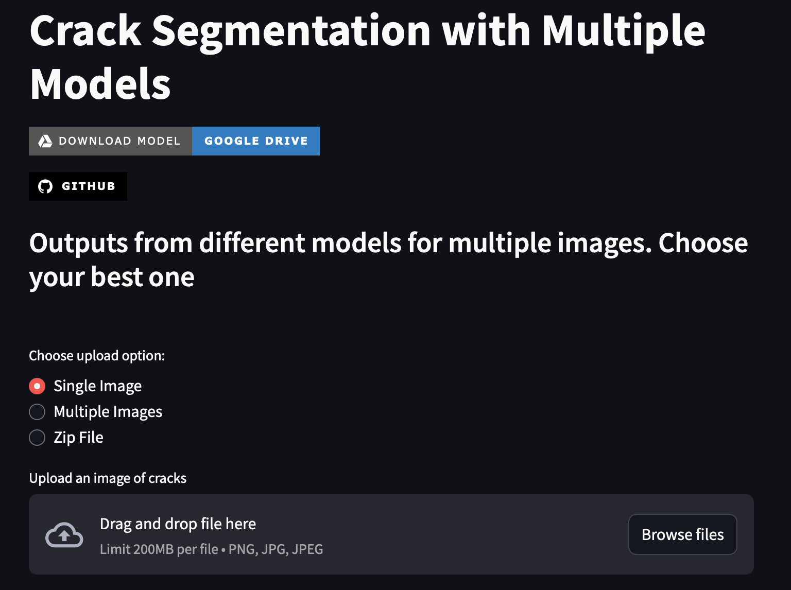
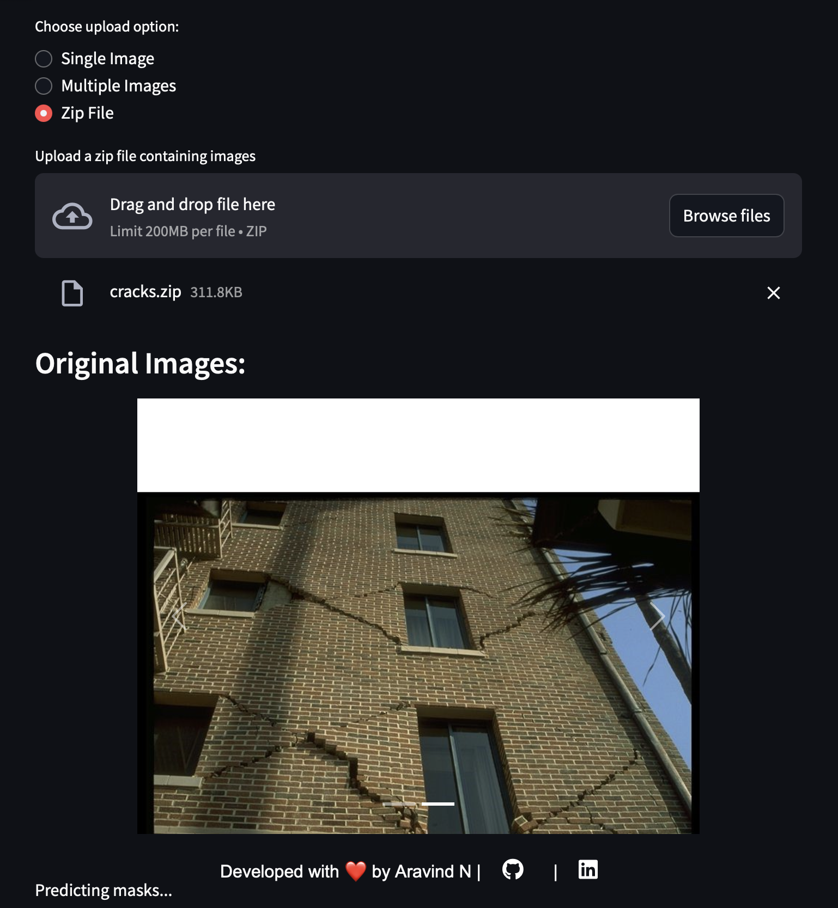
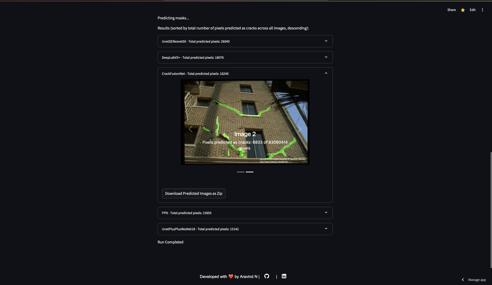

# Crack Segmentation Multi-Model Comparison

This Streamlit application allows users to compare multiple deep learning models for crack segmentation in images. Users can upload single or multiple images, or even a zip file containing images, and see the segmentation results from different models side by side.

## Features

- Support for single image, multiple image, and zip file uploads
- Comparison of five different [segmentation models](https://drive.google.com/drive/folders/1lO5lbg8K0qEqXvMA4bPif28Fs7T_YcJJ?usp=share_link):
    1. [CrackFusionNet](https://github.com/AravindXD/Cracks/blob/main/drive.py#L34-L35)
    2. [UnetSEResnet50: U-Net with SE-ResNet50 encoder](https://github.com/AravindXD/Cracks/blob/main/drive.py#L36-L50)
    3. [UnetPlusPlusResNet18: U-Net++ with ResNet18 encoder](https://github.com/AravindXD/Cracks/blob/main/drive.py#L52-L64)
    4. [DeepLabV3+: DeepLabV3+ with ResNet18 encoder](https://github.com/AravindXD/Cracks/blob/main/drive.py#L66-L78)
    5. [FPN: Feature Pyramid Network with ResNet18 encoder](https://github.com/AravindXD/Cracks/blob/main/drive.py#L80-L91)
    
- Display of original images in a carousel
- Visualization of segmentation results for each model
- Sorting of results based on total predicted crack pixels
- Download options for segmentation results

## [Dataset](https://paperswithcode.com/dataset/khanhha-s-dataset)
